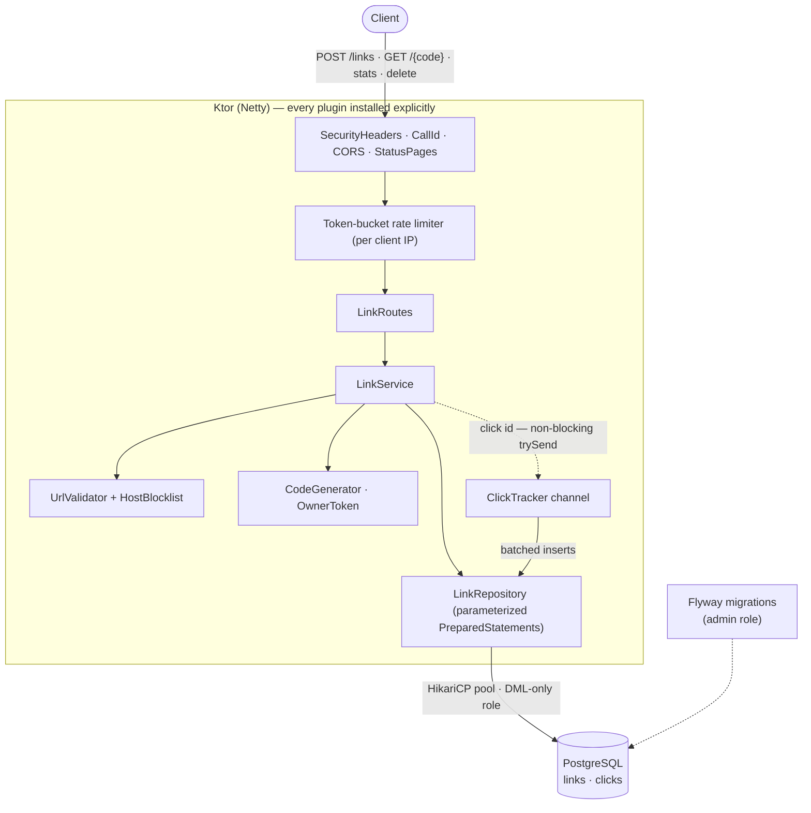

<div align="center">

# 🔗 Hlekkr

*Old Norse for "link / chain" — a direct hit for a service that makes links.*

**A link shortener that doesn't track you.** Paste a URL, get a short one back —
no accounts, no logins, clicks counted but never profiled. Built as a portfolio
project to *show the reasoning* behind persistence, concurrency, and security,
with a [Kotlin](https://kotlinlang.org) + [Ktor](https://ktor.io) API over raw
JDBC and a framework-free [React](https://react.dev) client.

[](https://github.com/martinzachariassen/hlekkr/actions/workflows/ci.yml)
[](https://github.com/martinzachariassen/hlekkr/actions/workflows/frontend-ci.yml)
[](https://github.com/martinzachariassen/hlekkr/actions/workflows/codeql.yml)
[](https://scorecard.dev/viewer/?uri=github.com/martinzachariassen/hlekkr)
[](LICENSE)
[](https://kotlinlang.org)
[](https://ktor.io)
[](https://adoptium.net)
[](https://www.postgresql.org)
[](https://react.dev)
[](https://railway.app)

[**Live site**](https://short.mlz.no) · [What it is](#what-it-is) · [Quick start](#quick-start) · [How it works](#how-it-works) · [API](#api) · [Security](#security-decisions) · [Deployment](#deployment) · [Docs](docs)

<a href="https://short.mlz.no">
  
</a>

</div>

## What it is

**Hlekkr** turns a long URL into a 7-character link and counts the clicks — that's
the whole product. The interesting part is *how* it's built. There's no Spring, no
ORM, no auto-configuration: every plugin, query, and dependency is wired by hand so
the reasoning behind each persistence, concurrency, and security decision stays
visible instead of hidden behind a framework. It's a monorepo of two independent
apps:

- **The API** ([`backend/`](backend)) — Kotlin + Ktor on Netty, talking to PostgreSQL
  through hand-written, parameterized JDBC. SSRF-preventive input validation, random
  non-enumerable codes, hashed owner tokens, per-IP rate limiting, and a least-privilege
  database role — each mapped to an explicit test.
- **The web client** ([`frontend/`](frontend)) — a single non-scrolling screen (Vite +
  React + TypeScript, no UI framework, one stylesheet). Paste a URL, get a short link
  and a one-time owner key; look a link up by code + key to see clicks or delete it.

Privacy is the pitch, so the redirect stores only a link id and a timestamp — no IP,
no user-agent, no referrer — and analytics is opt-in and cookieless.

## Tech stack

| Layer         | Choice                                                                 | Why                                                        |
| ------------- | --------------------------------------------------------------------- | --------------------------------------------------------- |
| API           | [Kotlin](https://kotlinlang.org) 2.4 · [Ktor](https://ktor.io) 3.5 (Netty) | Thin, coroutine-native, nothing reflective or auto-wired  |
| Persistence   | Raw JDBC + [HikariCP](https://github.com/brettwooldridge/HikariCP) over [PostgreSQL](https://www.postgresql.org) 18 | Hand-written `PreparedStatement`s — no ORM, no N+1, auditable SQL |
| Migrations    | [Flyway](https://flywaydb.org) 13 (`.sql`)                            | Versioned, reviewable, run under a privileged role         |
| Runtime       | [JDK](https://adoptium.net) 25                                        | Pinned via [mise](https://mise.jdx.dev)                    |
| Web client    | [Vite](https://vite.dev) 8 · [React](https://react.dev) 19 · TypeScript | One screen, one stylesheet, no framework or state library  |
| Edge / proxy  | [Caddy](https://caddyserver.com)                                     | The single public entrypoint; injects the service key      |
| Deploy        | Docker · any container platform                                       | Three services; only the proxy is public ([notes](docs/deployment.md)) |
| Toolchain     | [mise](https://mise.jdx.dev)                                          | Pins java/node/pnpm and owns every dev task                |

## Quick start

You need [mise](https://mise.jdx.dev) and Docker. One command pins the toolchain
(java/node/pnpm) and brings up **everything** — Postgres, the API from source, and
the web app — with dev-only defaults, so there's nothing to configure for a first run:

```bash
git clone git@github.com:martinzachariassen/hlekkr.git
cd hlekkr

mise install      # first time only: fetch the pinned tools
mise run dev      # API on :8080, web app on :5173 — Ctrl-C stops all
```

Open the web app at [localhost:5173](http://localhost:5173), or explore the API
directly at [`/swagger`](http://localhost:8080/swagger).

`mise tasks` lists the rest:

```bash
mise run backend    # just the API against local Postgres
mise run web        # just the web app (expects the API running)
mise run test       # backend suite: unit + Testcontainers + e2e (needs Docker)
mise run lint       # compile gate: allWarningsAsErrors
mise run build      # backend jar + frontend bundle
mise run up / down / logs   # the whole stack in Docker
```

Prefer just the API in Docker? `mise run up` starts Postgres 18, runs Flyway
migrations under the admin role (a one-shot `flyway` service), then starts the API
under the least-privilege app role. To override any default (passwords, CORS,
`INTERNAL_API_KEY`), copy `.env.example` to `.env` and edit — `.env` is git-ignored.

> [!NOTE]
> `mise run dev`/`backend` apply migrations on startup (admin creds) for convenience.
> Containers turn that off (`RUN_MIGRATIONS_ON_STARTUP=false`) because migrations are a
> separate, privileged step there.

## How it works

Redirects are the hot path and stay fast: the click write is pushed onto a coroutine
`Channel` and flushed in batches by a background consumer, so `GET /{code}` never waits
on a click insert.



### Why Ktor + raw JDBC over Spring/ORM

- **Ktor, not Spring.** Ktor is a thin, coroutine-native server. Nothing is
  auto-configured or reflective — plugin install order, the request pipeline, and every
  dependency are explicit in `Application.kt`. For a project meant to *demonstrate* how
  the pieces fit, that visibility is the point.
- **Raw JDBC, not an ORM.** Every query is a hand-written, parameterized
  `PreparedStatement` wrapped in a few small extension helpers (`repository/Database.kt`).
  No lazy loading, no N+1 surprise, no dialect leakage — the SQL that runs is the SQL in
  the file. It also makes the SQL-injection posture trivially auditable: grep for string
  concatenation in SQL and you'll find none.
- **Flyway for migrations.** Plain `.sql` files, versioned and reviewable, run under a
  privileged role at deploy time.

The tradeoff is more boilerplate than Spring Data would need. That boilerplate is the
deliverable here, not an accident.

## Project structure

```
hlekkr/
├── backend/                     # Ktor API (Kotlin, raw JDBC, Gradle)
│   └── src/main/kotlin/no/mlz/shortener/
│       ├── config/  plugins/    # AppConfig + explicit Ktor feature install
│       ├── routes/  service/    # LinkRoutes → LinkService
│       ├── repository/          # hand-written PreparedStatements (Database.kt)
│       └── security/            # UrlValidator, CodeGenerator, OwnerToken, HostBlocklist
├── frontend/                    # single-screen web client (Vite + React + TS)
│   ├── src/                     # components + one stylesheet
│   └── Caddyfile                # the single public entrypoint (prod)
├── docs/                        # the depth: security spec, per-app guides, deployment notes
├── mise.toml                    # pinned toolchain + one-command dev stack
├── docker-compose.yml           # Postgres + Flyway + API
└── .github/                     # CI: build/test, CodeQL, Trivy, Scorecard, blocklist refresh
```

## API

Interactive docs are served from the running app: **Swagger UI at
[`/swagger`](http://localhost:8080/swagger)** and the raw OpenAPI 3.1 spec at
[`/openapi.yaml`](http://localhost:8080/openapi.yaml) (both public). The spec is
hand-authored (`backend/src/main/resources/openapi/documentation.yaml`) — explicit and
reviewable, in keeping with the rest of the project.

| Method   | Path                  | Access                          | Notes                                                                    |
| -------- | --------------------- | ------------------------------- | ------------------------------------------------------------------------ |
| `POST`   | `/links`              | frontend key (rate-limited)     | Body `{targetUrl, expiresAt?}` → `{code, shortUrl, ownerToken}`. `ownerToken` is shown **once**. |
| `GET`    | `/{code}`             | **public**                      | `302` redirect. Records a click asynchronously. Generic `404` if missing/expired/deleted. |
| `GET`    | `/links/{code}/stats` | frontend key + Bearer owner token (rate-limited) | `{totalClicks, last7Days: [{date, count}]}`                 |
| `DELETE` | `/links/{code}`       | frontend key + Bearer owner token (rate-limited) | Soft delete.                                                |
| `GET`    | `/health`             | **public**                      | Liveness probe → `200 OK` (no dependency checks).                        |
| `GET`    | `/ready`              | **public**                      | Readiness probe → `200 READY`, or `503` if Postgres is unreachable. Used as the deploy health check. |

"frontend key" = the `X-Internal-Key` header explained in
[`docs/security.md`](docs/security.md#restricting-the-api-to-your-frontend). It is unset
(open) in local development. `curl` examples and the full request/response contract are in
[`docs/backend.md`](docs/backend.md).

## Security decisions

Written as decisions with reasoning, because that's what a reviewer reads. Each maps to
code and to an explicit test. The short version:

| Threat | Defense |
| ------ | ------- |
| SSRF / internal-network targets | `UrlValidator`: scheme allow-list; rejects loopback, private, link-local & cloud-metadata ranges — including alternate IPv4 encodings — plus embedded credentials and self-referential URLs |
| Link enumeration / scraping | 7-char random base62 codes from `SecureRandom`, never sequential; fail-closed retry on collision |
| Probing which codes exist | Missing, expired, deleted, and auth-failed all return the same generic `404` — never `403` |
| Owner-token theft from the DB | Tokens returned once, stored only as SHA-256, compared in constant time |
| Spam / abuse | Per-IP token-bucket rate limiting, strict on `POST /links` → `429` + `Retry-After` |
| Malware / phishing / adult targets | Suffix-matched domain blocklist, baked into the image at build time and refreshed weekly |
| Anyone-with-`curl` API use | `X-Internal-Key` service gate held by the Caddy proxy, never the browser |
| Detail leaks in errors | `StatusPages` maps everything to clean responses; correlation id only |
| Runaway or hostile queries | DML-only DB role, statement timeout, bounded connection pool |
| Oversized payloads | Bodies streamed with a hard 16 KB cap → `413` |

The full reasoning behind each decision — and why the service key, not CORS, is the real
gate — is in [`docs/security.md`](docs/security.md). Found a vulnerability? See
[`SECURITY.md`](SECURITY.md) for how to report it.

## Deployment

The stack is three ordinary containers — **web** (Caddy, the only public entrypoint),
**api**, and **Postgres** — each built from its own `Dockerfile`, so it runs on any
container platform. The one topology rule worth keeping: only the proxy is public, and the
proxy holds the key ([why](docs/security.md#restricting-the-api-to-your-frontend)). The
notes for my own deployment (Railway), including the full variable list and
troubleshooting, live in [`docs/deployment.md`](docs/deployment.md).

## Testing & CI

Three test layers, all run by `./gradlew build` (or `mise run test`): **unit** (JUnit 6 +
MockK), **repository** (Testcontainers against a real Postgres 18, including a
`'; DROP TABLE links; --` inertness test), and **end-to-end** (Ktor test client) covering
every endpoint and every security case from the table above. The full test inventory is in
[`docs/backend.md`](docs/backend.md#testing).

CI (GitHub Actions) runs the build + full suite, a [Trivy](https://trivy.dev) scan that
fails on any HIGH/CRITICAL CVE, `dependency-review` on PRs,
[OpenSSF Scorecard](https://scorecard.dev), CodeQL on the frontend, and a
Conventional-Commit PR-title check; Dependabot keeps dependencies current and `main` is
protected by a ruleset requiring the `build` check and a PR. On the backend, static
analysis is enforced at the compiler (`allWarningsAsErrors`); a dedicated Kotlin SAST
scanner is deliberately absent until one supports the pinned JDK 25 + Kotlin 2.4 toolchain
(details in [`docs/backend.md`](docs/backend.md#testing)).

## Out of scope (and why)

- **Multi-instance rate limiting.** The token bucket is in-memory, so limits are
  per-instance. Correct behind a single instance; a horizontally-scaled deployment would
  move the buckets to Redis. Kept in-memory here to avoid a second piece of infrastructure
  for a demo. The map is bounded — buckets that have refilled to full are evicted once it
  grows large — so churning/spoofed source IPs can't grow it without limit.
- **Click analytics beyond a count.** `clicks` stores only `link_id` and a timestamp — no
  IP, user-agent, or referrer. Collecting those would make this a tracking product and add a
  privacy-compliance surface that isn't the point. A crash between enqueue and flush can lose
  at most one un-flushed batch of counts — acceptable for analytics, not for billing-grade
  data.
- **User accounts / sessions.** Authorization is a single per-link owner token by design. A
  full identity system is a different project.

## License

[MIT](LICENSE) © [Martin Zachariassen](https://mlz.no)
</content>
</invoke>
