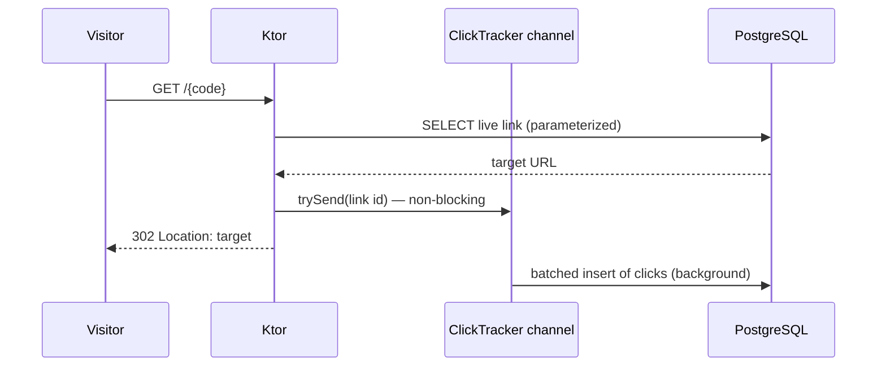

# Backend — the API

Kotlin 2.4 + [Ktor](https://ktor.io) (Netty) on JDK 25, raw JDBC over PostgreSQL 18, Flyway
migrations. The architecture overview lives in the [root README](../README.md) and the
security reasoning in [`security.md`](security.md) — this page covers running the app,
configuring it, and the contract it exposes to the [frontend](frontend.md).

## Running

From the repo root, [mise](https://mise.jdx.dev) pins the toolchain and wires up Postgres:

```bash
mise run backend    # Postgres (Docker) + the API from source, with dev defaults
mise run test       # full suite: unit + Testcontainers + e2e (needs Docker)
mise run lint       # compile gate: allWarningsAsErrors
```

Or directly with Gradle from `backend/` (you provide the `DATABASE_*` env vars yourself):

```bash
./gradlew build          # compile + full test suite
./gradlew run            # start the API
./gradlew shadowJar      # runnable fat jar in build/libs/*-all.jar
```

## Configuration

All config is env-driven. Non-secret defaults live in
[`application.conf`](../backend/src/main/resources/application.conf); the app **fails fast
at startup** if a required secret is missing or blank.

| Variable | Required | Purpose |
| --- | --- | --- |
| `DATABASE_URL` | yes | JDBC URL (`jdbc:postgresql://…` — note the prefix) |
| `DATABASE_USER` / `DATABASE_PASSWORD` | yes | the app's **DML-only** role |
| `RUN_MIGRATIONS_ON_STARTUP` | no (default `true`) | apply Flyway migrations on boot |
| `DATABASE_MIGRATION_USER` / `_PASSWORD` | no | privileged role for migrations; omit **both** to reuse the app credentials (single-role setups) |
| `BASE_URL` | no (default `http://localhost:8080`) | public URL short links are built from; also the self-referential target check |
| `INTERNAL_API_KEY` | no | blank = management routes **open** (dev); set = `X-Internal-Key` required |
| `CORS_ALLOWED_ORIGINS` | no | comma-separated allow-list; empty disables cross-origin access |
| `TRUST_PROXY_HEADERS` | no (default `false`) | read the client IP from `X-Forwarded-For` — only behind a trusted proxy |
| `SERVER_HOST` / `PORT` | no | bind address (`::` on IPv6-only private networks) and port |
| `BLOCKED_HOSTS` / `BLOCKED_HOSTS_FILE` | no | content-policy denylist, suffix-matched |
| `DB_MAX_POOL_SIZE` | no (default `10`) | Hikari pool bound |

## Package layout

Source under `src/main/kotlin/no/mlz/shortener/`, split by role; tests mirror the same tree
under `src/test/kotlin/`.

| Package | Responsibility |
| --- | --- |
| `config/` | env-driven `AppConfig`, fails fast on missing secrets |
| `plugins/` | explicit Ktor feature install (CORS, StatusPages, OpenAPI, serialization) |
| `routes/` | HTTP surface + DTOs |
| `service/` | `LinkService`, `UrlValidator`, `ClickTracker` |
| `repository/` | hand-written `PreparedStatement`s over HikariCP |
| `security/` | code generation, owner tokens, rate limiting, blocklist, headers |

## The contract with the frontend

The full endpoint reference is the hand-authored OpenAPI spec, served at
[`/openapi.yaml`](http://localhost:8080/openapi.yaml) with a self-hosted Swagger UI at
[`/swagger`](http://localhost:8080/swagger). What the API **guarantees** to its client:

- Every error body has the same shape — `{"error": "...", "correlationId": "..."}` — and
  the correlation id is also returned as `X-Correlation-Id`. `400` messages are client-safe
  and can be shown verbatim; nothing internal ever leaks.
- Missing, expired, deleted, and auth-failed are all the **same generic `404`** — by
  design, a client cannot distinguish them (see the root README's security section).
- `429` always carries `Retry-After` (seconds).
- `ownerToken` is returned **once** in the `201` create response and is never retrievable
  again — the client must surface it to the user immediately.

What the API **requires** of its caller:

- When `INTERNAL_API_KEY` is set, `POST /links`, stats, and delete need the
  `X-Internal-Key` header. In production that header is injected by the Caddy proxy —
  never by the browser (see [frontend.md](frontend.md)); both services must hold the same
  key value.
- Stats and delete need `Authorization: Bearer <ownerToken>`.
- `POST /links` bodies are JSON and capped at 16 KB (`413` beyond that).
- When `TRUST_PROXY_HEADERS=true`, the proxy in front must pin `X-Forwarded-For` to the
  real client IP (the [`Caddyfile`](../frontend/Caddyfile) does) — otherwise per-IP rate
  limiting buckets every visitor together.
- `BASE_URL` must be the public domain that routes `/{code}` back to this API (the web
  proxy's domain), or the short links it returns won't resolve.

### Examples

```bash
# Create (locally, with no INTERNAL_API_KEY set)
curl -s -X POST localhost:8080/links \
  -H 'Content-Type: application/json' \
  -d '{"targetUrl":"https://example.com"}'
# → {"code":"d10ndrX","shortUrl":"http://localhost:8080/d10ndrX","ownerToken":"g3UQ…"}

# Redirect
curl -i localhost:8080/d10ndrX          # 302 Location: https://example.com

# Stats / delete (owner token required)
curl localhost:8080/links/d10ndrX/stats -H "Authorization: Bearer g3UQ…"
curl -X DELETE localhost:8080/links/d10ndrX -H "Authorization: Bearer g3UQ…"

# Once INTERNAL_API_KEY is set, management calls also need the service header:
curl -X POST localhost:8080/links -H 'X-Internal-Key: <key>' \
  -H 'Content-Type: application/json' -d '{"targetUrl":"https://example.com"}'
```

## The redirect hot path

`GET /{code}` never waits on a click write — the id goes onto a bounded channel and a
background consumer batches the inserts:



## Testing

```bash
cd backend
./gradlew build test
```

- **Unit** (JUnit 6 + MockK): `UrlValidator`, `LinkService`, `CodeGenerator`, rate limiter,
  owner-token hashing, and the service-key constant-time compare.
- **Repository** (Testcontainers, real Postgres 18): parameterized queries, uniqueness,
  soft-delete/expiry filtering, click aggregation, and a `'; DROP TABLE links; --`
  inertness test.
- **End-to-end** (Ktor test client + Testcontainers): every endpoint plus the explicit
  security cases — dangerous schemes, private/metadata targets, oversized body → `413`,
  malformed JSON → clean `400`, missing/wrong owner token → `404`, missing/wrong service key
  → `404` (with the redirect still public), rate limit → `429 + Retry-After` (create *and*
  stats), the security headers, CORS scheme-pinning, the DB-backed readiness probe, the
  self-hosted (CDN-free) Swagger UI, and that `/health` and `/openapi.yaml` stay public.

Static analysis is enforced at the compiler: `allWarningsAsErrors = true` fails the build
on any Kotlin warning. A dedicated SAST scanner for Kotlin (CodeQL / detekt) is
intentionally *not* wired in yet — as of this writing neither supports the bleeding-edge
**JDK 25 + Kotlin 2.4** toolchain this project pins (CodeQL's Kotlin extractor sees "no
source"; detekt's bundled compiler rejects JVM target 25). It should be added once the
tooling catches up, or by pinning an older toolchain.
