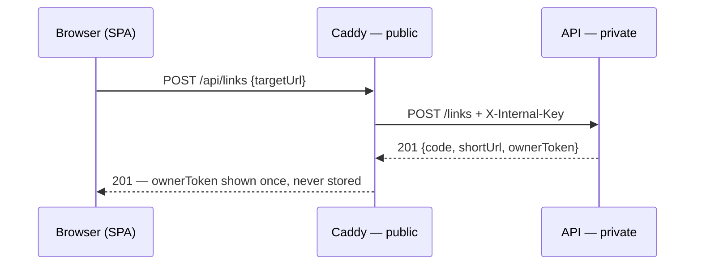

# Frontend — the web client

A single-screen client for the [backend API](backend.md): paste a URL, get a short one back
plus a one-time owner key; look a link up by code + key to see its clicks or delete it.

**Stack:** Vite + React + TypeScript. No UI framework and no state library — a handful of
components and one stylesheet. Theme (warm paper, teal accent) is borrowed from
[mlz.no](https://mlz.no); body/UI type is [Inter](https://rsms.me/inter/) with Instrument
Serif for the display headline.

## Running

From the repo root, `mise run dev` starts Postgres, the API, and this app together. To run
the frontend alone against an already-running API:

```bash
pnpm install
pnpm dev            # http://localhost:5173
```

## Configuration

Copy `.env.example` to `.env.local` and adjust. All vars are build-time (`VITE_*`), so
treat the bundle as public — never put a real secret in it.

| Variable | Purpose |
| --- | --- |
| `VITE_API_BASE` | Where API calls go. Dev: `http://localhost:8080` (default). Prod: `/api`, same-origin through the Caddy proxy. |
| `VITE_UMAMI_SRC` + `VITE_UMAMI_WEBSITE_ID` | Enable [Umami](https://umami.is) analytics. Unset ⇒ zero analytics code ships. |

There is deliberately **no** internal-key variable here: in production the key lives on the
Caddy proxy and is injected server-side, so it never reaches the browser.

## The contract with the backend

Everything the client consumes, and what it assumes about the responses
(see [`src/api.ts`](../frontend/src/api.ts)):

| Call | Expects |
| --- | --- |
| `POST /links` `{targetUrl, expiresAt?}` | `201` → `{code, shortUrl, ownerToken}` — the token is shown once and held only in component state, never persisted |
| `GET /links/{code}/stats` + `Bearer` key | `{totalClicks, last7Days: [{date, count}]}` — zero-click days may be absent |
| `DELETE /links/{code}` + `Bearer` key | `204` |
| any error | `{error, correlationId}` — `400` reasons are client-safe and shown verbatim; the correlation id is appended to unexpected errors as a support reference |
| `404` | shown as one generic "No link found for that code and key" — the API deliberately never says *why* |
| `429` | the `Retry-After` header drives the "try again in _n_ s" message |

Cold starts are expected: the API may idle to zero, so the client retries gateway `5xx`
and dropped connections with backoff, and shows a "waking the server" hint if any request
runs past ~2.5 s.

The production create flow, end to end:



## Production build & proxy

The `Dockerfile` builds the static bundle (`VITE_API_BASE=/api` is baked in as a build arg)
and serves it from [Caddy](https://caddyserver.com), the only public service. Caddy fronts
the private backend: it injects `X-Internal-Key` on `/api/*` and passes the public routes
(`/{code}` redirect, `/openapi.yaml`, `/swagger`) straight through, so the app and its API
are same-origin (no CORS) and the key stays server-side.

What the [`Caddyfile`](../frontend/Caddyfile) requires:

- `API_UPSTREAM` — the backend's private address (e.g. `api.railway.internal:8080`).
- `INTERNAL_API_KEY` — the **same value** the backend holds; a mismatch makes every
  management call answer `404`.
- The short-link matcher `^/[0-9A-Za-z]{7}$` is **coupled to the backend's
  `app.code.length`** (7) — change one, change both.

## Analytics

Umami is cookieless and privacy-first, which is why it's the one tracker here — it never
contradicts the "no tracking" promise on the page. It loads only when both env vars are
set. Actionable controls carry `data-umami-event` attributes (Umami binds them on click); a
few outcomes Umami can't observe (`shorten-success`, `stats-view`, `delete-success`) are
reported via `umami.track(...)`.
