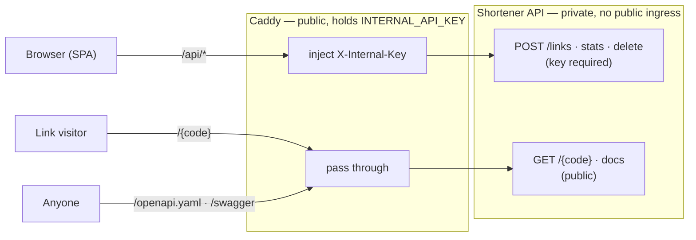

# Security decisions

The threat → defense summary lives in the [root README](../README.md#security-decisions);
this page is the full reasoning, written as decisions because that's what a reviewer reads.
Each maps to code and to an explicit test.

- **Input validation is SSRF-preventive, on purpose.** `UrlValidator` allows only
  `http`/`https`, and rejects loopback/link-local/private ranges (`127/8`, `10/8`,
  `172.16/12`, `192.168/16`, `169.254/16` incl. the `169.254.169.254` cloud-metadata
  endpoint, `::1`, `fc00::/7`), `localhost`, embedded credentials, and URLs pointing back
  at this service's own domain. This service does **not** fetch the target today, so none
  of this is load-bearing yet — it exists so that adding a preview/screenshot feature
  later cannot silently open an SSRF hole. DNS is deliberately *not* resolved at creation
  time: it would add nondeterminism and its own lookup surface and would be stale by fetch
  time, so any future fetch must re-validate the resolved address then.
- **Content policy via a domain blocklist.** Separately from the SSRF checks,
  `UrlValidator` consults a `HostBlocklist` and refuses to shorten targets on it (adult,
  malware, phishing). Matching is by domain *suffix* — one entry covers a domain and all its
  subdomains — and each in-memory check walks the host's label suffixes, so even a
  100k-domain feed costs nothing per request. The production image **bakes two free,
  maintained lists at build time** — [HaGeZi NSFW](https://github.com/hagezi/dns-blocklists)
  (adult, ~115k domains) and [URLhaus](https://urlhaus.abuse.ch/) (fresh malware) — so there
  is **no runtime dependency**; a weekly
  [`refresh-blocklist`](../.github/workflows/refresh-blocklist.yml) workflow re-fetches both
  feeds (failing loudly if either 404s or shrinks suspiciously — a canary for upstream URL
  rot), bumps a cache-bust marker, and lets the auto-deploy rebuild with current lists.
  Local Compose builds skip the fetch (`FETCH_BLOCKLISTS=false`) and run with an empty,
  no-op list. Operators can override with `BLOCKED_HOSTS` (inline) or `BLOCKED_HOSTS_FILE`
  (one domain per line, or `hosts`-file format). Live URL-level verdicts (e.g. Google Safe
  Browsing) are deliberately not wired in: a synchronous third-party call gating every write
  isn't worth it here, and it wouldn't cover adult content anyway.
- **Short codes are random, not sequential.** A base62-of-autoincrement scheme is
  enumerable — walk `/1`, `/2`, `/3` and scrape every link ever made. Codes are 7 random
  base62 characters from `SecureRandom` with a DB uniqueness check and a bounded retry that
  **fails closed**. (Sqids was considered and rejected: it is reversible given the salt.)
- **Owner tokens, hashed at rest.** No user accounts. Creation returns a 256-bit
  `SecureRandom` token once; only its SHA-256 hash is stored. Stats/delete compare against
  the hash in constant time and return **`404`, not `403`**, on mismatch — so the API can't
  be used to probe which codes exist.
- **Undifferentiated 404s.** Missing, expired, deleted, and auth-failed all return the same
  generic `404` on the public surface. Detail is reserved for authenticated calls.
- **Rate limiting.** In-memory per-IP token bucket: strict on `POST /links` (the
  spam/phishing surface), looser on `GET /{code}`. Exceeding it returns `429` with
  `Retry-After`. This is single-instance state and does **not** survive horizontal scaling
  — Redis is the swap-in for that (see the README's
  [out-of-scope](../README.md#out-of-scope-and-why) section).
- **No raw errors leak.** A global `StatusPages` handler maps known failures to clean 4xx
  and everything else to a generic `500`. Exception messages, stack traces, and SQL text
  are logged server-side with a correlation id that is also returned to the client
  (`X-Correlation-Id` and in the error body) for support — never the underlying detail.
- **Frontend-only management surface.** `POST /links`, stats, and delete require an
  `X-Internal-Key` header matching a per-deployment secret that only the frontend holds; a
  constant-time compare gates it and a miss returns the same generic `404`. The redirect
  stays public. See [below](#restricting-the-api-to-your-frontend) for why this — not
  CORS — is the real gate.
- **Hardening headers on every response.** HSTS, `X-Content-Type-Options: nosniff`,
  `X-Frame-Options: DENY`, `Referrer-Policy: no-referrer`, and `Content-Security-Policy:
  default-src 'none'` (this is a JSON API that serves no HTML — the Swagger UI docs get a
  narrowly-relaxed same-origin CSP so the page can load its own assets). CORS is an explicit
  allow-list, never `*`, and credentials are not enabled.
- **Least-privilege database role.** Migrations run under a privileged admin role (the
  `flyway` step in Compose, or a deploy job); the application connects under a role with
  **DML only** — no DDL, not a superuser. `ALTER DEFAULT PRIVILEGES` grants the app DML on
  the tables the admin creates. A statement timeout and a bounded Hikari pool cap the blast
  radius of a runaway query.
- **Bounded request bodies.** `POST /links` bodies are capped (16 KB) and streamed with a
  hard limit → `413`, so an oversized payload can't hang or OOM the server.
- **Secrets only from the environment.** DB credentials come from env vars; the app **fails
  fast at startup** if a required one is missing or blank. `.env` is git-ignored; only
  `.env.example` is committed. The connection string is never logged.

## Restricting the API to your frontend

The goal: only the project's own frontend can create, inspect, or delete links — not
anyone with `curl`. The redirect endpoint `GET /{code}` is the exception; it *is* the
short link, so it must stay public.

**CORS is not enough.** CORS is a browser-enforced policy: it stops a malicious *web page*
from reading your API cross-origin, but `curl`, Postman, and any server ignore it
entirely. Relying on CORS alone would leave `POST /links` open to the world. So the real
gate is a **shared service key**: the management routes require an `X-Internal-Key` header
whose value only the frontend knows, checked in constant time, with a miss returning the
same generic `404` as everything else.

The key belongs to the frontend's **server**, never the browser. Here that server is the
[Caddy](https://caddyserver.com) proxy in front of the web app
([`frontend/Caddyfile`](../frontend/Caddyfile)), which is the **only service with a public
domain**. The API sits on the private network with no public ingress of its own, so every
public request goes through Caddy: it injects `X-Internal-Key` on `/api/*` and passes the
genuinely public routes (redirect, spec, Swagger) straight through. The secret never ships
to the client, and because the calls are same-origin, no CORS is involved at all.

This composes with the existing per-link owner token to give two independent layers: the
service key answers *"is this the frontend?"* and the owner token answers *"does this
caller own this link?"*. Locally, leaving `INTERNAL_API_KEY` unset disables the gate (the
app logs a warning at startup) so development stays friction-free.
